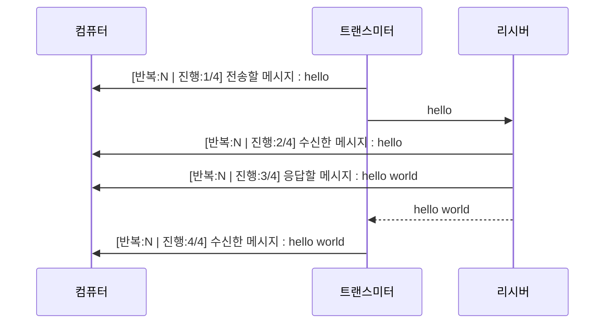
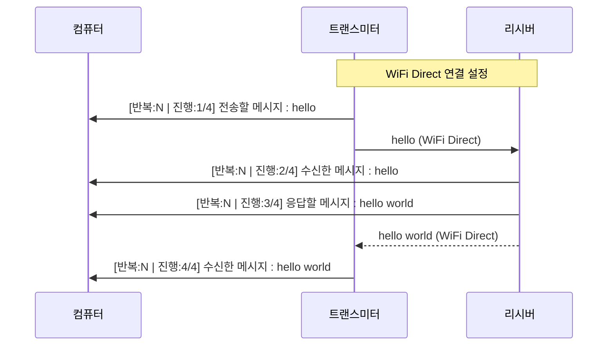
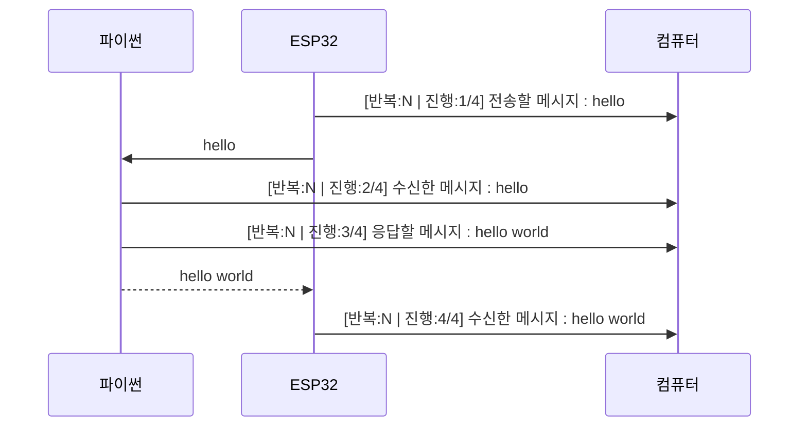
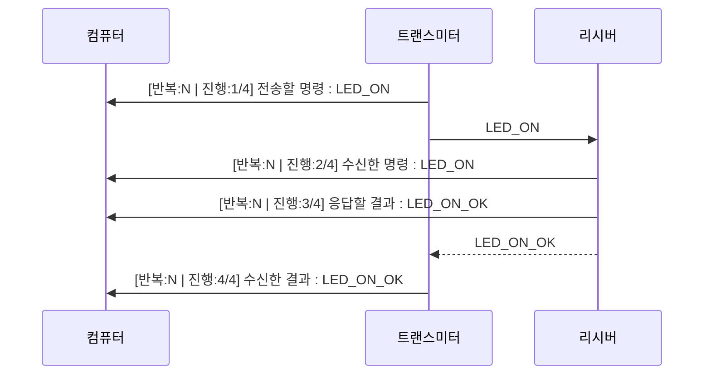

# ESP32 통신 프로젝트

이 프로젝트는 ESP32 보드를 사용한 다양한 통신 방식(WiFi, BLE 등)을 구현하고 비교하는 예제 모음입니다.

## 프로젝트 목록

### 1. 아두이노 블루투스 통신
#### 프로젝트 개요
ESP32 두 개를 블루투스를 통해 연결하여 "hello" 메시지를 주고받는 아두이노 기반 프로젝트입니다.

#### 통신 흐름


#### 통신 과정 설명
1. 트랜스미터는 5초마다 "hello" 메시지를 리시버에게 전송합니다.
   - 전송 전에 시리얼 모니터에 "[반복:N | 진행:1/4] 전송할 메시지 : hello"를 출력합니다.
2. 리시버는 메시지를 받으면:
   - 수신한 메시지를 "[반복:N | 진행:2/4] 수신한 메시지 : hello"로 출력합니다.
   - 받은 메시지에 "world"를 붙여서 "[반복:N | 진행:3/4] 응답할 메시지 : hello world"를 출력하고 응답합니다.
3. 트랜스미터는 리시버로부터 받은 응답을 "[반복:N | 진행:4/4] 수신한 메시지 : hello world"로 출력합니다.

#### 하드웨어 요구사항
- ESP32 보드 2개 (트랜스미터와 리시버)
- USB 케이블 2개
- 컴퓨터 (시리얼 모니터용)

#### 소프트웨어 요구사항
- Arduino IDE
- ESP32 보드 지원 패키지
- BLE 라이브러리

#### 설정 방법
1. 트랜스미터 코드를 첫 번째 ESP32 보드에 업로드합니다.
2. 리시버 코드를 두 번째 ESP32 보드에 업로드합니다.
3. 각 보드를 컴퓨터에 연결하고 시리얼 모니터를 엽니다.
4. 시리얼 모니터의 통신 속도는 115200 baud로 설정합니다.

#### 주의사항
- 시리얼 통신 초기화 후 100ms의 딜레이가 필요합니다.
- CPU 부하 감소를 위해 루프에 0.5초의 딜레이가 포함되어 있습니다.
- 트랜스미터와 리시버의 MAC 주소가 올바르게 설정되어 있는지 확인하세요.

### 2. 아두이노 WiFi Direct 통신
#### 프로젝트 개요
ESP32 두 개를 WiFi Direct 방식으로 연결하여 "hello" 메시지를 주고받는 아두이노 기반 프로젝트입니다. 공유기나 핫스팟 없이 MAC 주소를 기반으로 보드 간 직접 연결을 구현합니다.

#### 통신 흐름


#### 통신 과정 설명
1. 트랜스미터는 SoftAP 모드로 동작하여 WiFi 네트워크를 생성합니다.
2. 리시버는 Station 모드로 동작하여 트랜스미터의 WiFi 네트워크에 연결합니다.
3. 연결이 완료되면 트랜스미터는 5초마다 "hello" 메시지를 리시버에게 전송합니다.
   - 전송 전에 시리얼 모니터에 "[반복:N | 진행:1/4] 전송할 메시지 : hello"를 출력합니다.
4. 리시버는 메시지를 받으면:
   - 수신한 메시지를 "[반복:N | 진행:2/4] 수신한 메시지 : hello"로 출력합니다.
   - 받은 메시지에 "world"를 붙여서 "[반복:N | 진행:3/4] 응답할 메시지 : hello world"를 출력하고 응답합니다.
5. 트랜스미터는 리시버로부터 받은 응답을 "[반복:N | 진행:4/4] 수신한 메시지 : hello world"로 출력합니다.

#### 하드웨어 요구사항
- ESP32 보드 2개 (트랜스미터와 리시버)
- USB 케이블 2개
- 컴퓨터 (시리얼 모니터용)

#### 소프트웨어 요구사항
- Arduino IDE
- ESP32 보드 지원 패키지
- WiFi 라이브러리

#### 설정 방법
1. 트랜스미터 코드를 첫 번째 ESP32 보드에 업로드합니다.
2. 리시버 코드를 두 번째 ESP32 보드에 업로드합니다.
3. 각 보드를 컴퓨터에 연결하고 시리얼 모니터를 엽니다.
4. 시리얼 모니터의 통신 속도는 115200 baud로 설정합니다.

#### 주의사항
- 시리얼 통신 초기화 후 100ms의 딜레이가 필요합니다.
- CPU 부하 감소를 위해 루프에 0.5초의 딜레이가 포함되어 있습니다.
- 트랜스미터와 리시버의 MAC 주소가 올바르게 설정되어 있는지 확인하세요.
- WiFi 연결이 끊어질 경우 자동으로 재연결을 시도합니다.

### 3. 파이썬 블루투스 통신
#### 프로젝트 개요
ESP32와 파이썬을 사용하여 블루투스 통신을 구현하는 프로젝트입니다. ESP32는 블루투스 서버로 동작하고, 파이썬 스크립트는 클라이언트로 동작하여 메시지를 주고받습니다.

#### 개발 환경 설정
1. Anaconda/Miniconda 설치
   - [Anaconda 다운로드 페이지](https://www.anaconda.com/download) 또는 [Miniconda 다운로드 페이지](https://docs.conda.io/en/latest/miniconda.html)에서 설치
   - 설치 시 "Add Anaconda to PATH" 옵션 체크
   - 설치 완료 후 터미널에서 `conda --version`으로 설치 확인

2. Conda 가상환경 설정
   ```bash
   # 프로젝트 디렉토리로 이동
   cd hello_world_python_bluetooth

   # 가상환경 생성 (최신 Python 버전 사용)
   conda create -n esp32 python

   # 가상환경 활성화
   conda activate esp32

   # 가상환경이 제대로 활성화되었는지 확인
   # 프롬프트 앞에 (esp32)가 표시되어야 함
   python --version  # Python 버전 확인
   ```

3. 필요한 패키지 설치
   ```bash
   # pip 업그레이드
   python -m pip install --upgrade pip

   # esptool 설치 (MicroPython 펌웨어 업로드용)
   pip install esptool
   esptool --version  # 설치 확인 (Windows)
   # 또는
   python -m esptool --version  # 설치 확인 (Windows)

   # rshell 설치 (파일 전송 및 REPL 접근용)
   pip install rshell
   rshell --version  # 설치 확인

   # 기타 필요한 패키지 설치
   pip install -r requirements.txt
   ```

4. MicroPython 펌웨어 설치
   ```bash
   # ESP32-C3 펌웨어 다운로드
   # 최신 안정 버전: v1.25.0 (2024-04-15)
   # 다운로드 링크: https://micropython.org/download/ESP32_GENERIC_C3/
   # 파일명: ESP32_GENERIC_C3-20250415-v1.25.0.bin

   # 기존 펌웨어 삭제
   esptool --port COM5 erase_flash  # Windows
   # 또는
   python -m esptool --port COM5 erase_flash  # Windows

   # MicroPython 펌웨어 업로드
   esptool --port COM5 --baud 460800 write_flash -z 0x0 ESP32_GENERIC_C3-20250415-v1.25.0.bin  # Windows
   # 또는
   python -m esptool --port COM5 --baud 460800 write_flash -z 0x0 ESP32_GENERIC_C3-20250415-v1.25.0.bin  # Windows

   # 업로드 후 시리얼 모니터로 확인
   # 기본 REPL 접속 정보:
   # - 포트: COM5 (Windows)
   # - 보드레이트: 115200
   # - 접속 후 Ctrl+B를 눌러 REPL 모드 진입
   # - Ctrl+Q로 REPL 모드 종료
   ```

5. REPL(Read-Eval-Print Loop) 사용하기
   ```bash
   # REPL이란?
   # REPL은 MicroPython의 대화형 인터프리터입니다.
   # - Read: 사용자의 입력을 읽음
   # - Eval: 입력된 코드를 평가/실행
   # - Print: 실행 결과를 출력
   # - Loop: 위 과정을 반복
   
   # REPL 접속 방법
   python -m serial.tools.miniterm COM5 115200

   # REPL 모드 진입 (Ctrl+B)
   # >>> 프롬프트가 나타나면 REPL 모드 진입 성공
   
   # REPL 사용 예시
   >>> print("Hello, ESP32!")  # 문자열 출력
   Hello, ESP32!
   
   >>> 1 + 1  # 간단한 계산
   2
   
   >>> import machine  # 모듈 임포트
   >>> led = machine.Pin(2, machine.Pin.OUT)  # LED 핀 설정
   >>> led.value(1)  # LED 켜기
   >>> led.value(0)  # LED 끄기
   
   # REPL 모드 종료 (Ctrl+Q)
   # 종료 후 다시 Ctrl+B로 REPL 모드 진입 가능
   ```

6. 펌웨어 업로드 확인
   ```bash
   # 시리얼 모니터로 접속
   python -m serial.tools.miniterm COM5 115200

   # REPL에서 다음 명령어로 버전 확인
   >>> import sys
   >>> sys.version
   '3.4.0; MicroPython v1.25.0 on 2024-04-15; ESP32C3 module with ESP32C3'
   ```

#### 통신 흐름


#### 통신 과정 설명
1. ESP32는 블루투스 서버로 동작하며 5초마다 "hello" 메시지를 전송합니다.
   - 전송 전에 시리얼 모니터에 "[반복:N | 진행:1/4] 전송할 메시지 : hello"를 출력합니다.
2. 파이썬 스크립트는 블루투스 클라이언트로 동작하며:
   - 수신한 메시지를 "[반복:N | 진행:2/4] 수신한 메시지 : hello"로 출력합니다.
   - 받은 메시지에 "world"를 붙여서 "[반복:N | 진행:3/4] 응답할 메시지 : hello world"를 출력하고 응답합니다.
3. ESP32는 파이썬 스크립트로부터 받은 응답을 "[반복:N | 진행:4/4] 수신한 메시지 : hello world"로 출력합니다.

#### 하드웨어 요구사항
- ESP32 보드 1개 (블루투스 서버)
- USB 케이블 1개
- 컴퓨터 (파이썬 실행 및 시리얼 모니터용)

#### 소프트웨어 요구사항
- Python 3.8 이상 (3.11 또는 3.12 권장)
- MicroPython 펌웨어 (ESP32-C3용)
- esptool (펌웨어 업로드용)
- rshell 또는 ampy (파일 전송용)
- Arduino IDE (ESP32 코드 업로드용)
- ESP32 보드 지원 패키지
- BLE 라이브러리

#### 설정 방법
1. ESP32 코드를 보드에 업로드합니다.
2. 파이썬 가상환경을 설정하고 필요한 패키지를 설치합니다.
3. ESP32를 컴퓨터에 연결하고 시리얼 모니터를 엽니다.
4. 파이썬 스크립트를 실행하여 블루투스 통신을 시작합니다.

#### 주의사항
- 시리얼 통신 초기화 후 100ms의 딜레이가 필요합니다.
- CPU 부하 감소를 위해 루프에 0.5초의 딜레이가 포함되어 있습니다.
- ESP32의 MAC 주소가 올바르게 설정되어 있는지 확인하세요.
- 파이썬 스크립트 실행 전 가상환경이 활성화되어 있는지 확인하세요.
- Windows에서 블루투스 통신을 사용하려면 관리자 권한이 필요할 수 있습니다.

### 4. 파이썬 WiFi LED 제어
#### 프로젝트 개요
ESP32 두 개를 WiFi를 통해 연결하여 가변저항으로 LED를 제어하는 MicroPython 기반 프로젝트입니다. 트랜스미터는 WiFi AP 모드로 동작하며 가변저항 값을 읽어 LED 제어 명령을 생성하고, 리시버는 클라이언트 모드로 동작하여 LED를 제어합니다.

#### 통신 흐름


#### 통신 과정 설명
1. 트랜스미터는 WiFi AP 모드로 동작하여 `ESP32_LED_AP` 네트워크를 생성합니다.
2. 리시버는 WiFi 클라이언트 모드로 동작하여 트랜스미터의 네트워크에 연결합니다.
3. 연결이 완료되면 트랜스미터는 5초마다 가변저항 값을 읽어 해당하는 LED 제어 명령을 생성합니다:
   - `LED_ON`: LED 켜기
   - `LED_OFF`: LED 끄기
   - `LED_BLINK:<count>:<interval>`: LED 깜빡이기
4. 리시버는 명령을 받으면:
   - 수신한 명령을 "[반복:N | 진행:2/4] 수신한 명령 : {command}"로 출력
   - 명령을 실행하고 결과를 "[반복:N | 진행:3/4] 응답할 결과 : {result}"로 출력
   - 실행 결과를 트랜스미터에 응답
5. 트랜스미터는 리시버로부터 받은 결과를 "[반복:N | 진행:4/4] 수신한 결과 : {result}"로 출력

#### 하드웨어 요구사항
- ESP32 보드 2개 (트랜스미터와 리시버)
- USB 케이블 2개
- 가변저항 1개 (트랜스미터 보드의 GPIO 3번 핀에 연결)
  - VCC: 3.3V
  - GND: G
  - 중간 핀: GPIO 3
- LED 1개 (리시버 보드의 GPIO 2번 핀에 연결)
- 220Ω 저항 1개 (LED와 함께 사용)
- 컴퓨터 (시리얼 모니터용)

#### 소프트웨어 요구사항
- MicroPython 펌웨어 (ESP32-C3용)
- esptool (펌웨어 업로드용)
- rshell 또는 ampy (파일 전송용)
- Python 3.8 이상 (3.11 또는 3.12 권장)

#### 설정 방법
1. ESP32 보드에 MicroPython 펌웨어를 업로드합니다.
2. 트랜스미터와 리시버 코드를 각각의 보드에 업로드합니다.
3. 리시버 보드의 GPIO 2번 핀에 LED를 연결합니다.
4. 각 보드를 컴퓨터에 연결하고 시리얼 모니터를 엽니다.
5. 시리얼 모니터의 통신 속도는 115200 baud로 설정합니다.

#### 가변저항 제어 방식
1. 가변저항 값 범위 (0-4095)를 3개의 구간으로 나눔:
   - 0-1365: LED 끄기 (`LED_OFF`)
   - 1366-2730: LED 켜기 (`LED_ON`)
   - 2731-4095: LED 깜빡이기 (`LED_BLINK:3:500`)

2. 트랜스미터는 5초마다 가변저항 값을 읽어 해당하는 LED 제어 명령을 생성합니다.

#### 주의사항
- 시리얼 통신 초기화 후 100ms의 딜레이가 필요합니다.
- CPU 부하 감소를 위해 루프에 0.1초의 딜레이가 포함되어 있습니다.
- WiFi 연결이 끊어질 경우 자동으로 재연결을 시도합니다.
- LED는 반드시 220Ω 저항과 함께 사용해야 합니다.
- GPIO 2번 핀은 내장 LED가 있는 경우 해당 LED를 사용합니다.

## 아두이노 CLI 설정 및 사용 방법

### 1. 아두이노 CLI 설치
1. [아두이노 CLI 다운로드 페이지](https://arduino.github.io/arduino-cli/latest/installation/)에서 운영체제에 맞는 버전 다운로드
2. 다운로드한 파일을 적절한 위치에 압축 해제 (예: `C:\Program Files\Arduino CLI`)
3. 시스템 환경 변수 PATH에 아두이노 CLI 경로 추가

### 2. ESP32 보드 매니저 설정
터미널에서 다음 명령어를 실행하여 ESP32 보드 매니저를 추가합니다:
```bash
arduino-cli core update-index
arduino-cli core install esp32:esp32
```

### 3. 보드 목록 확인
```bash
arduino-cli board list
```

### 4. 코드 컴파일 및 업로드
Cursor IDE의 터미널에서 다음 명령어를 사용하여 코드를 컴파일하고 업로드할 수 있습니다:

#### 컴파일
```bash
arduino-cli compile --fqbn esp32:esp32:Geekble_ESP32C3 [스케치_폴더_경로]
```

#### 업로드
```bash
arduino-cli upload -p [포트] --fqbn esp32:esp32:Geekble_ESP32C3 [스케치_폴더_경로]
```

예시 (transmitter 코드 업로드):
```bash
# 컴파일
arduino-cli compile --fqbn esp32:esp32:Geekble_ESP32C3 hello_world_arduino_bluetooth/transmitter

# 업로드 (COM5 포트 사용 시)
arduino-cli upload -p COM5 --fqbn esp32:esp32:Geekble_ESP32C3 hello_world_arduino_bluetooth/transmitter
```

예시 (receiver 코드 업로드):
```bash
# 컴파일
arduino-cli compile --fqbn esp32:esp32:Geekble_ESP32C3 hello_world_arduino_bluetooth/receiver

# 업로드 (COM6 포트 사용 시)
arduino-cli upload -p COM6 --fqbn esp32:esp32:Geekble_ESP32C3 hello_world_arduino_bluetooth/receiver
```

### 5. 시리얼 모니터링
트랜스미터 모니터링:
```bash
arduino-cli monitor -p COM5 -c baudrate=115200
```

리시버 모니터링:
```bash
arduino-cli monitor -p COM6 -c baudrate=115200
```

### CLI 사용 시 주의사항
1. 포트 번호는 시스템에 따라 다를 수 있습니다 (Windows의 경우 COM5, COM6 등)
2. 업로드 전에 올바른 포트가 선택되어 있는지 확인
3. ESP32 보드가 USB로 연결되어 있어야 함
4. 필요한 경우 드라이버 설치 필요
5. **반드시 보드 매니저에서 Geekble Mini ESP32-C3(혹은 사용 중인 ESP32-C3 계열 보드)를 선택하세요.**
6. CLI/배치파일에서 정확한 FQBN은 다음과 같이 지정해야 합니다:
   - `esp32:esp32:Geekble_ESP32C3`
7. 잘못된 보드 타입(예: esp32:esp32:esp32c3)으로 지정하면 업로드 및 실행에 문제가 발생할 수 있습니다.

### 유용한 CLI 명령어
- 보드 목록 확인: `arduino-cli board list`
- 사용 가능한 보드 검색: `arduino-cli board search esp32`
- 코어 목록 확인: `arduino-cli core list`
- 라이브러리 검색: `arduino-cli lib search [라이브러리명]`
- 라이브러리 설치: `arduino-cli lib install [라이브러리명]`

## 통신 흐름


## 통신 과정 설명

1. 트랜스미터는 5초마다 "hello" 메시지를 리시버에게 전송합니다.
   - 전송 전에 시리얼 모니터에 "[반복:N | 진행:1/4] 전송할 메시지 : hello"를 출력합니다.
2. 리시버는 메시지를 받으면:
   - 수신한 메시지를 "[반복:N | 진행:2/4] 수신한 메시지 : hello"로 출력합니다.
   - 받은 메시지에 "world"를 붙여서 "[반복:N | 진행:3/4] 응답할 메시지 : hello world"를 출력하고 응답합니다.
3. 트랜스미터는 리시버로부터 받은 응답을 "[반복:N | 진행:4/4] 수신한 메시지 : hello world"로 출력합니다.

## 하드웨어 요구사항

- ESP32 보드 2개 (트랜스미터와 리시버)
- USB 케이블 2개
- 컴퓨터 (시리얼 모니터용)

## 소프트웨어 요구사항

- Arduino IDE
- ESP32 보드 지원 패키지
- BLE 라이브러리

## 설정 방법

1. 트랜스미터 코드를 첫 번째 ESP32 보드에 업로드합니다.
2. 리시버 코드를 두 번째 ESP32 보드에 업로드합니다.
3. 각 보드를 컴퓨터에 연결하고 시리얼 모니터를 엽니다.
4. 시리얼 모니터의 통신 속도는 115200 baud로 설정합니다.

## 주의사항

- 시리얼 통신 초기화 후 100ms의 딜레이가 필요합니다.
- CPU 부하 감소를 위해 루프에 0.5초의 딜레이가 포함되어 있습니다.
- 트랜스미터와 리시버의 MAC 주소가 올바르게 설정되어 있는지 확인하세요.

## 라이선스

이 프로젝트는 MIT 라이선스 하에 배포됩니다.

## 커서룰즈

### BLE 통신 변수 선언 규칙
BLE 통신 구현 시 다음 변수들은 반드시 전역 변수로 선언해야 합니다:

```cpp
// 필수 전역 변수 선언
BLEClient* 컴퓨터lient = nullptr;        // BLE 클라이언트 객체
BLEAddress* pServerAddress = nullptr; // 서버 주소 객체
BLERemoteCharacteristic* pRemoteCharacteristic = nullptr; // 원격 특성 객체
bool doConnect = false;              // 연결 상태 플래그
uint8_t notificationOn[2] = {0x01, 0x00}; // 알림 활성화 값

// 콜백 클래스는 반드시 전역 변수 선언 전에 정의
class MyAdvertisedDeviceCallbacks: public BLEAdvertisedDeviceCallbacks {
    // ... 콜백 구현 ...
};
```

### BLE 통신 구현 순서
1. 전역 변수 선언
2. 콜백 클래스 정의
3. 서비스/특성 UUID 정의
4. setup() 함수에서 BLE 초기화
5. 연결 및 통신 구현

### 주의사항
- BLE 객체는 반드시 포인터로 선언
- 콜백 클래스는 전역 변수 선언 전에 정의
- UUID는 const char* 또는 BLEUUID로 정의
- 연결 상태 관리를 위한 플래그 변수 필수
