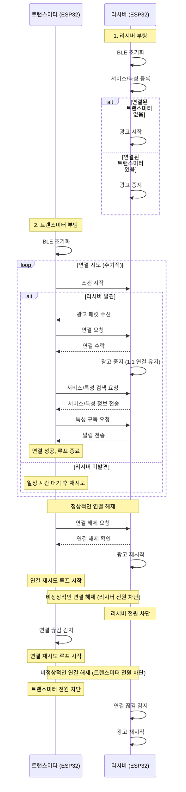
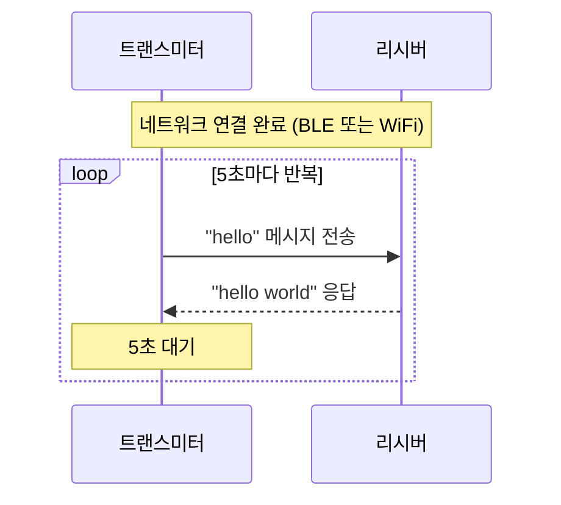
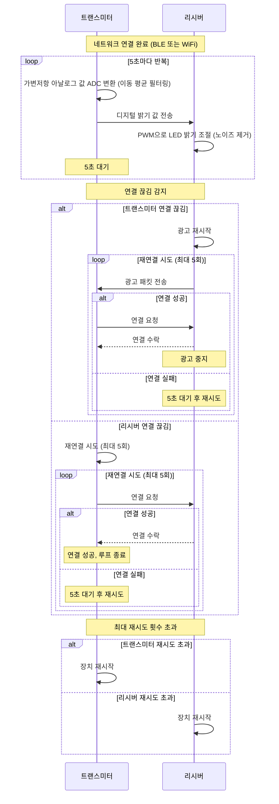
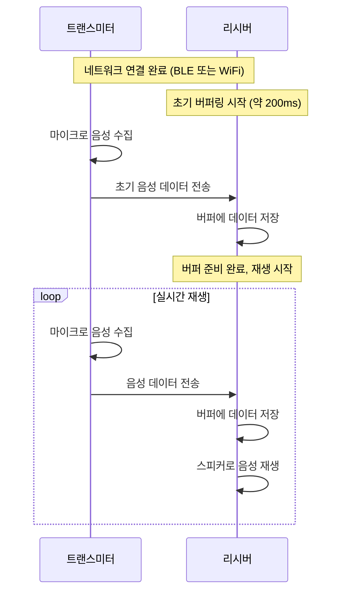

```mermaid
sequenceDiagram
    participant Transmitter as 트랜스미터 (Station 모드)
    participant Receiver as 리시버 (AP 모드)

    Note over Receiver: 1. 리시버 부팅
    Receiver->>Receiver: WiFi 초기화
    Receiver->>Receiver: AP 모드 설정
    Receiver->>Receiver: SSID/비밀번호 설정
    Receiver->>Receiver: IP 주소 설정
    Receiver->>Receiver: AP 시작

    Note over Transmitter: 2. 트랜스미터 부팅
    Transmitter->>Transmitter: WiFi 초기화
    Transmitter->>Transmitter: Station 모드 설정
    Transmitter->>Receiver: AP 검색
    Receiver-->>Transmitter: AP 정보 수신
    Transmitter->>Receiver: 연결 요청
    Receiver-->>Transmitter: 연결 수락
    Transmitter->>Receiver: 데이터 전송
    Receiver-->>Transmitter: 데이터 수신

    Note over Receiver,Transmitter: 정상적인 연결 해제
    Transmitter->>Receiver: 연결 해제 요청
    Receiver-->>Transmitter: 연결 해제 확인
    Note over Transmitter: 재연결 시도 루프 시작
    loop 재연결 시도 (주기적)
        Transmitter->>Transmitter: AP 검색
        Receiver-->>Transmitter: AP 정보 수신
        Transmitter->>Receiver: 연결 요청
        Receiver-->>Transmitter: 연결 수락
        Note over Transmitter: 연결 성공, 루프 종료
    end

    Note over Receiver,Transmitter: 비정상적인 연결 해제 (리시버 전원 차단)
    Note over Receiver: 리시버 전원 차단
    Transmitter->>Transmitter: 연결 끊김 감지
    Note over Transmitter: 재연결 시도 루프 시작
    loop 재연결 시도 (주기적)
        Transmitter->>Transmitter: AP 검색
        alt AP 발견
            Receiver-->>Transmitter: AP 정보 수신
            Transmitter->>Receiver: 연결 요청
            Receiver-->>Transmitter: 연결 수락
            Note over Transmitter: 연결 성공, 루프 종료
        else AP 미발견
            Note over Transmitter: 일정 시간 대기 후 재시도
        end
    end

    Note over Receiver,Transmitter: 비정상적인 연결 해제 (트랜스미터 전원 차단)
    Note over Transmitter: 트랜스미터 전원 차단
    Receiver->>Receiver: 연결 끊김 감지
    Note over Receiver: 새로운 연결 대기
    Note over Transmitter: 트랜스미터 재부팅
    Transmitter->>Receiver: AP 검색
    Receiver-->>Transmitter: AP 정보 수신
    Transmitter->>Receiver: 연결 요청
    Receiver-->>Transmitter: 연결 수락
```

# ESP32-C3 통신 프로젝트

이 프로젝트는 ESP32-C3 보드를 사용한 다양한 통신 방식(WiFi, BLE 등)을 구현하고 비교하는 예제 모음입니다. 현재는 Geekble에서 제조한 ESP32-C3 보드를 사용하고 있으며, 이 보드의 정확한 보드 타입은 `esp32:esp32:Geekble_ESP32C3`입니다. 다른 제조사의 ESP32-C3 보드를 사용할 경우, 해당 보드의 정확한 보드 타입을 확인해야 합니다.

> **ESP32-C3 하드웨어**: 32비트 RISC-V 단일 코어(160MHz), 400KB RAM, 4MB Flash를 탑재한 저전력 IoT 칩셋으로, WiFi와 BLE 5.0을 동시 지원하며 다양한 센서와 통신 인터페이스(I2C, SPI, UART)를 제공합니다. 메모리 제한(400KB RAM)으로 인해 대용량 데이터 처리나 복잡한 이미지 처리는 제한적이지만, 기본적인 IoT 프로젝트와 센서 데이터 수집/전송에는 충분한 성능을 제공합니다.

## 세부 프로젝트 명명 규칙

이 ESP32-C3 통신 프로젝트는 여러 개의 세부 프로젝트로 구성되어 있으며, 각 세부 프로젝트는 다음과 같은 폴더 구조를 따릅니다:

```
[기능]/[언어]_[통신방식]/
```

### 폴더 구조 설명
- **기능 폴더**
  - `hello_world/`: 기본 통신 예제
  - `led_control/`: LED 제어 예제
  - `voice_streaming/`: 음성 스트리밍 예제

- **하위 폴더 (언어_통신방식)**
  - `arduino_bluetooth/`: Arduino + Bluetooth 구현
  - `arduino_wifi/`: Arduino + WiFi 구현
  - `python_bluetooth/`: Python + Bluetooth 구현
  - `python_wifi/`: Python + WiFi 구현

### 폴더 구조 예시
```
esp32_communication/
├── hello_world/
│   ├── arduino_bluetooth/
│   ├── arduino_wifi/
│   ├── python_bluetooth/
│   └── python_wifi/
├── led_control/
│   ├── arduino_bluetooth/
│   ├── arduino_wifi/
│   ├── python_bluetooth/
│   └── python_wifi/
├── voice_streaming/
│   ├── arduino_bluetooth/
│   ├── arduino_wifi/
│   ├── python_bluetooth/
│   └── python_wifi/
├── batch/
│   ├── transmitter.bat
│   └── receiver.bat
└── README.md
```

> **참고**: 
> - 각 기능 폴더 아래에는 해당 기능을 구현하는 다양한 언어와 통신 방식의 조합이 포함됩니다.
> - 아직 구현되지 않은 조합의 경우, 해당 폴더를 미리 만들어두고 나중에 구현할 수 있습니다.
> - 배치 파일은 프로젝트 루트의 `batch/` 폴더에서 공통으로 관리됩니다.
> - 예: `batch/transmitter.bat hello_world arduino_bluetooth`는 hello_world 기능의 Arduino Bluetooth 구현의 트랜스미터를 업로드합니다.

## 목차
- [세부 프로젝트 명명 규칙](#세부-프로젝트-명명-규칙)
- [프로그래밍 언어 및 환경](#프로그래밍-언어-및-환경)
- [통신 구조](#통신-구조)
- [동작](#동작)
- [공통 설정](#공통-설정)
- [라이선스](#라이선스)

## 프로그래밍 언어 및 환경

ESP32-C3 보드에서 안정적으로 사용 가능한 주요 프로그래밍 언어/환경은 다음과 같습니다:

1. **C/C++ (Arduino Framework)**
   - 가장 일반적이고 안정적인 개발 환경
   - Arduino IDE나 PlatformIO를 통한 개발 가능
   - 하드웨어 제어가 용이하고 성능이 좋음
   - 본 프로젝트에서는 Arduino Framework를 사용

2. **MicroPython**
   - 파이썬 기반의 임베디드 프로그래밍 환경
   - 빠른 프로토타이핑에 적합
   - 파이썬의 간단한 문법으로 개발 가능

> 참고: ESP32-C3 보드에서는 Rust나 Lua(NodeMCU)와 같은 다른 언어도 사용 가능하지만, 현재 안정성과 지원이 제한적이므로 본 프로젝트에서는 C/C++과 MicroPython만 다룹니다.

### C/C++ (Arduino Framework)
ESP32-C3 보드의 C/C++ 개발을 위한 두 가지 방법이 있으며, **둘 중 하나만 선택**하여 사용하면 됩니다:

1. **Arduino IDE 사용** (초보자 추천)
   - GUI 기반의 통합 개발 환경
   - 코드 작성, 컴파일, 업로드가 한 곳에서 가능
   - 직관적인 인터페이스로 쉽게 시작 가능
   - 시리얼 모니터가 내장되어 있어 디버깅이 편리

2. **Arduino CLI + Cursor IDE 사용** (고급 사용자 추천)
   - 명령줄 기반의 개발 환경
   - 배치 파일을 통한 자동화된 빌드/업로드 가능
   - Cursor IDE와 연동하여 사용 가능
   - 자동화나 스크립트 작성이 필요한 경우 적합

> **참고**: Arduino IDE와 Arduino CLI는 동일한 보드 지원 패키지를 사용하지만, 개발 환경은 완전히 독립적입니다. 프로젝트의 요구사항과 선호도에 따라 둘 중 하나를 선택하여 사용하시면 됩니다.

#### Arduino IDE 개발 환경 설정
1. **Arduino IDE 설치**
   - [Arduino IDE 다운로드 페이지](https://www.arduino.cc/en/software)에서 설치
   - 설치 완료 후 Arduino IDE 실행

2. **ESP32 보드 지원 패키지 설치**
   - File > Preferences 메뉴 선택
   - Additional Boards Manager URLs에 다음 URL 추가:
     ```
     https://raw.githubusercontent.com/espressif/arduino-esp32/gh-pages/package_esp32_index.json
     ```
   - Tools > Board > Boards Manager 메뉴 선택
   - 검색창에 "esp32" 입력
   - "ESP32 by Espressif Systems" 설치

3. **보드 설정**
   - Tools > Board > ESP32 Arduino 메뉴에서 "Geekble ESP32C3" 선택
   - Tools > Port 메뉴에서 연결된 보드의 포트 선택
   - Tools > Upload Speed: "115200" 선택
   - Tools > CPU Frequency: "160MHz (WiFi/BT)" 선택
   - Tools > Flash Frequency: "80MHz" 선택
   - Tools > Flash Mode: "QIO" 선택
   - Tools > Flash Size: "4MB (32Mb)" 선택
   - Tools > Partition Scheme: "Default 4MB with spiffs" 선택
   - Tools > Core Debug Level: "None" 선택
   - Tools > PSRAM: "Disabled" 선택

4. **코드 업로드**
   - Sketch > Upload 메뉴 선택 또는 Ctrl+U 단축키 사용
   - 업로드 진행 상태는 하단 상태 표시줄에서 확인 가능

5. **시리얼 모니터**
   - Tools > Serial Monitor 메뉴 선택 또는 Ctrl+Shift+M 단축키 사용
   - 통신 속도는 115200 baud로 설정

#### Arduino CLI 개발 환경 설정 (Cursor IDE)
1. **Arduino CLI 설치**
   - [아두이노 CLI 다운로드 페이지](https://arduino.github.io/arduino-cli/latest/installation/)에서 운영체제에 맞는 버전 다운로드
   - 다운로드한 파일을 적절한 위치에 압축 해제 (예: `C:\Program Files\Arduino CLI`)
   - 시스템 환경 변수 PATH에 아두이노 CLI 경로 추가

2. **ESP32 보드 매니저 설정**
   ```bash
   # 보드 매니저 URL 추가
   arduino-cli config add board_manager.additional_urls https://raw.githubusercontent.com/espressif/arduino-esp32/gh-pages/package_esp32_index.json
   
   # 보드 매니저 업데이트
   arduino-cli core update-index
   
   # ESP32 보드 지원 패키지 설치
   arduino-cli core install esp32:esp32
   ```

3. **보드 설정**
   ```bash
   # 보드 목록 확인
   arduino-cli board list
   
   # 보드 설정 확인
   arduino-cli board details -b esp32:esp32:Geekble_ESP32C3
   ```

4. **코드 컴파일 및 업로드**
   ```bash
   # 컴파일
   arduino-cli compile --fqbn esp32:esp32:Geekble_ESP32C3 [스케치_폴더_경로]
   
   # 업로드
   arduino-cli upload -p [포트] --fqbn esp32:esp32:Geekble_ESP32C3 [스케치_폴더_경로]
   ```

5. **시리얼 모니터링**
   ```bash
   arduino-cli monitor -p [포트] -c baudrate=115200
   ```

> **참고**: 현재 프로젝트는 Geekble ESP32-C3 보드를 사용하여 개발되었으며, 보드 타입도 `esp32:esp32:Geekble_ESP32C3`로 설정되어 있습니다. 다른 보드나 다른 환경에서는 동작하지 않을 수 있습니다.

> **참고**: Arduino IDE와 Arduino CLI는 동일한 보드 지원 패키지를 사용하므로, 한쪽에서 설치한 패키지는 다른 쪽에서도 사용 가능합니다.

### MicroPython
#### 개발 환경 설정
1. Anaconda/Miniconda 설치
   - [Anaconda 다운로드 페이지](https://www.anaconda.com/download) 또는 [Miniconda 다운로드 페이지](https://docs.conda.io/en/latest/miniconda.html)에서 설치
   - 설치 시 "Add Anaconda to PATH" 옵션 체크
   - 설치 완료 후 터미널에서 `conda --version`으로 설치 확인

2. Conda 가상환경 설정
   ```bash
   # 프로젝트 루트 디렉토리에서 실행
   # 모든 MicroPython 프로젝트가 공통으로 사용할 가상환경 생성
   conda create -n esp32 python

   # 가상환경 활성화
   conda activate esp32

   # 가상환경이 제대로 활성화되었는지 확인
   python --version
   ```

3. 필요한 패키지 설치
   ```bash
   # pip 업그레이드
   python -m pip install --upgrade pip

   # esptool 설치 (MicroPython 펌웨어 업로드용)
   pip install esptool
   
   # rshell 설치 (파일 전송 및 REPL 접근용)
   pip install rshell
   
   # 프로젝트 루트 디렉토리의 requirements.txt에서 공통 라이브러리 설치
   # 모든 MicroPython 프로젝트가 공통으로 사용할 라이브러리
   pip install -r requirements.txt
   ```

> 참고: 모든 MicroPython 프로젝트는 동일한 가상환경과 공통 라이브러리를 사용합니다. requirements.txt는 프로젝트 루트 디렉토리에 위치하며, 각 프로젝트별로 별도의 requirements.txt를 관리할 필요가 없습니다.

4. MicroPython 펌웨어 설치
   ```bash
   # ESP32-C3 펌웨어 다운로드
   # 최신 안정 버전: v1.25.0 (2025-04-15)
   # 다운로드 링크: https://micropython.org/download/ESP32_GENERIC_C3/
   # 파일명: ESP32_GENERIC_C3-20250415-v1.25.0.bin

   # 기존 펌웨어 삭제
   esptool --port COM5 erase_flash

   # MicroPython 펌웨어 업로드
   esptool --port COM5 --baud 460800 write_flash -z 0x0 ESP32_GENERIC_C3-20250415-v1.25.0.bin
   ```

## 통신 구조

### 통신 방식 비교
| 특성 | 블루투스 (BLE) | WiFi |
|------|---------------|------|
| 통신 거리 | ~100m | ~100m (실내) / ~300m (실외) |
| 전력 소비 | 낮음 (BLE 모드) | 높음 |
| 데이터 전송 속도 | ~1Mbps | ~150Mbps (802.11n) |
| 연결 방식 | 1:1 또는 1:N | 1:N (AP 모드) 또는 N:1 (Station 모드) |
| 보안 | 암호화 지원 | WPA/WPA2 암호화 |
| 초기 설정 | MAC 주소 기반 | SSID/비밀번호 기반 |
| 사용 사례 | 센서 데이터, 제어 신호 | 대용량 데이터, 웹 서버 |
| 연결 시간 | 빠름 (~100ms) | 느림 (~1-3초) |
| 안정성 | 중간 (간섭에 민감) | 높음 (간섭에 강함) |

> **참고**: BLE와 WiFi는 서로 배타적인 통신 방식이 아닙니다. ESP32는 동시에 BLE와 WiFi를 사용할 수 있으며, 각각의 통신은 독립적으로 동작합니다. 예를 들어:
> - BLE로 센서 데이터를 수집하면서
> - WiFi로 웹 서버를 운영하거나
> - BLE로 LED를 제어하면서
> - WiFi로 로그 데이터를 전송하는 등의
> 동시 사용이 가능합니다.

### 블루투스 (BLE) 통신
#### 연결 구조


#### 필수 구성 요소
1. **리시버 (ESP32)**
   - 서비스 UUID 정의
   - 특성 UUID 정의
   - 알림/인디케이션 설정
   - 연결 이벤트 처리
   - 연결 끊김 감지 및 처리
   - 재연결 시 광고 재시작

2. **트랜스미터 (ESP32)**
   - MAC 주소 기반 스캔
   - 서비스/특성 검색
   - 알림 구독
   - 데이터 송수신
   - 연결 끊김 감지
   - 주기적인 재연결 시도

3. **연결 관리**
   - 정상적인 연결 해제 처리
   - 비정상적인 연결 해제 감지
   - 연결 상태 모니터링
   - 재연결 로직
   - 타임아웃 설정

4. **보안 설정 (ESP32 간 통신)**
   - 인증 방식
     - Just Works (현재 프로젝트)
       - 코드에 하드코딩된 인증 정보 사용
       - 사용자 입력 불필요
       - 개발/테스트 환경에 적합
     
     - 하드코딩된 Passkey
       - 코드에 미리 정의된 6자리 숫자 사용
       - 사용자 입력 없이 자동 인증
       - 실제 제품 환경에 적합
   
   - 암호화
     - 128비트 AES 암호화
     - 데이터 전송 시 자동 암호화
   
   > **보안 주의사항**
   > - 현재 프로젝트는 개발/테스트 환경을 위해 하드코딩된 인증 정보를 사용합니다.
   > - 실제 제품 환경에서는 다음과 같은 보안 강화가 필요합니다:
   >   1. 동적 인증 키 생성 및 관리
   >   2. 안전한 키 저장소 사용
   >   3. 정기적인 키 교체 메커니즘
   >   4. 추가적인 암호화 레이어 구현
   > - ESP32와 사용자 인터페이스가 있는 장치(스마트폰, PC 등) 간 통신의 경우, 사용자 입력 기반의 보안 방식을 고려해야 합니다.

### WiFi 통신
#### 연결 구조


#### 필수 구성 요소
1. **리시버 (AP 모드)**
   - SSID 설정
   - 비밀번호 설정
   - IP 주소 설정 (고정 IP 권장)
   - 최대 연결 수 설정 (1로 제한)
   - 연결 상태 모니터링

2. **트랜스미터 (Station 모드)**
   - AP의 SSID/비밀번호 설정
   - IP 설정 (DHCP 또는 고정 IP)
   - 재연결 로직
   - 연결 상태 모니터링

3. **연결 관리**
   - 정상적인 연결 해제 처리
   - 비정상적인 연결 해제 감지
   - 연결 상태 모니터링
   - 재연결 로직
   - 타임아웃 설정

4. **보안 설정**
   - WPA/WPA2 암호화
   - 고정된 SSID/비밀번호 사용
   - MAC 주소 기반 접근 제어 (선택적)
     - 특정 MAC 주소만 연결 허용
     - 현재 프로젝트에서는 트랜스미터의 MAC 주소만 허용

> **참고**: 현재 프로젝트는 라우터 없이 ESP32 두 보드 간 직접 통신을 구현합니다. 리시버(AP 모드)가 WiFi 네트워크를 생성하고, 트랜스미터(Station 모드)가 이 네트워크에 연결하는 방식으로 동작합니다.

#### WiFi 통신 프로토콜
WiFi 통신은 TCP/IP 스택을 사용하여 다음과 같은 프로토콜을 지원합니다:

1. **TCP/IP**
   - 연결 지향적 통신
   - 신뢰성 있는 데이터 전송
   - 웹 서버/클라이언트 구현
   - 예: HTTP, WebSocket

2. **UDP**
   - 비연결형 통신
   - 빠른 데이터 전송
   - 실시간 데이터 스트리밍
   - 예: 실시간 센서 데이터 전송

> **참고**: BLE는 자체적인 프로토콜 스택을 사용하며, TCP/IP나 UDP와는 다른 방식으로 통신합니다. BLE는 GATT 프로토콜을 기반으로 서비스와 특성을 통해 데이터를 주고받습니다.

## 동작

### hello <-> world
네트워크 연결이 완료된 후, 트랜스미터는 5초마다 리시버에게 "hello" 메시지를 전송하고, 리시버는 "hello world"로 응답합니다.



### LED 밝기 제어
트랜스미터는 GPIO 3번 핀에 연결된 가변저항의 아날로그 전압값을 ADC를 통해 디지털 값으로 읽어 리시버로 전송하고, 리시버는 GPIO 3번 핀에 연결된 LED의 밝기를 PWM 방식으로 제어합니다.



#### LED 제어 프로젝트 주요 기능
1. **트랜스미터**
   - ADC 설정
     - GPIO 3번 핀 사용
     - 12비트 해상도 (0-4095)
     - 3.3V 기준 전압
   - ADC 값 필터링
     - 5회 이동 평균 필터링
     - 노이즈 감소
   - 데이터 전송
     - 5초 간격으로 전송
     - 재시도 제한 (최대 5회)
     - 연결 상태 모니터링

2. **리시버**
   - PWM 설정
     - GPIO 3번 핀 사용
     - 8비트 해상도 (0-255)
     - 5kHz 주파수
   - LED 제어
     - ADC-PWM 변환
     - 노이즈 제거 (임계값 기반)
     - 범위 검증
   - 연결 관리
     - 연결 끊김 감지
     - 재연결 광고
     - 타임아웃 처리 (10초)

3. **공통 기능**
   - 재시도 제한
     - 최대 5회 재시도
     - 5초 재시도 간격
     - 재시도 초과 시 장치 재시작
   - 연결 상태 모니터링
     - 연결/끊김 감지
     - 타임아웃 처리
     - 자동 재연결
   - 에러 처리
     - 예외 상황 처리
     - 리소스 정리
     - 디버깅 정보 출력

### 음성 스트리밍 (TODO)
트랜스미터는 GPIO 3번 핀에 연결된 마이크로 음성을 수집하여 리시버로 전송하고, 리시버는 GPIO 3번 핀에 연결된 스피커로 음성을 재생합니다. 초기 버퍼링에 약 200ms가 소요되며, 이후 실시간으로 음성이 재생됩니다.



## 공통 설정

### 버전 정보
현재 프로젝트는 다음 버전의 도구와 라이브러리를 사용하여 개발되었습니다:

1. **개발 도구**
   - Arduino IDE: 2.3.6
   - Arduino CLI: 1.2.2
   - Cursor IDE: 1.0.0
   - Python: 3.13 (MicroPython 개발용)

2. **ESP32 보드 지원 패키지**
   - Arduino ESP32: 2.0.18-arduino.5
   - ESP32 (Espressif): 3.2.0
   - ESP32 보드 매니저 URL: https://raw.githubusercontent.com/espressif/arduino-esp32/gh-pages/package_esp32_index.json

3. **MicroPython**
   - 펌웨어 버전: v1.25.0 (2025-04-15)
   - 다운로드 링크: https://micropython.org/download/ESP32_GENERIC_C3/
   - 파일명: ESP32_GENERIC_C3-20250415-v1.25.0.bin

> **참고**: 
> - 위 버전들은 프로젝트 개발 시점의 안정 버전입니다.
> - 새로운 버전이 출시되더라도, 이 버전들로 테스트된 코드는 안정적으로 동작합니다.
> - 다른 버전을 사용할 경우 예상치 못한 문제가 발생할 수 있으므로, 가능하면 동일한 버전을 사용하는 것을 권장합니다.

### 하드웨어 요구사항
- ESP32-C3 보드 2개 (트랜스미터와 리시버)
- USB Type-C 케이블 2개 (ESP32-C3 보드 연결용)
- 컴퓨터 (시리얼 모니터용)
- LED 및 저항 (LED 제어 프로젝트용)
- 가변저항 (LED 제어 프로젝트용)
- 마이크 모듈 (음성 스트리밍 프로젝트용)
  - MAX9814 또는 유사한 마이크 모듈
  - 3.3V 동작 전압
  - 아날로그 출력 지원
- 스피커 모듈 (음성 스트리밍 프로젝트용)
  - 3.3V 동작 전압
  - 아날로그 입력 지원
  - 작은 크기의 스피커 (예: 8Ω, 0.5W)

### 보드 설정
- 보드 타입: `esp32:esp32:Geekble_ESP32C3`
- 통신 속도: 115200 baud
- 시리얼 통신 초기화 딜레이: 100ms

### 통신 규칙
#### 시리얼 통신
- 초기화 후 100ms 딜레이 필요
- 통신 속도: 115200 baud

#### 블루투스 UUID
- UUID 클래스 사용 필수 (MicroPython: `bluetooth.UUID`, Arduino: `BLEUUID`)
- 공통 UUID 설정 (모든 프로젝트에서 동일하게 사용)
  - 서비스 UUID: '6E400001-B5A3-F393-E0A9-E50E24DCCA9E'
    - 특성 UUID (송신용): '6E400002-B5A3-F393-E0A9-E50E24DCCA9E'
    - 특성 UUID (수신용): '6E400003-B5A3-F393-E0A9-E50E24DCCA9E'
- 지원 형식:
  - 16비트 정수 (예: 0x2908)
  - 128비트 UUID 문자열 (예: '6E400001-B5A3-F393-E0A9-E50E24DCCA9E')

> **참고**: 
> - 모든 블루투스 프로젝트는 동일한 UUID를 사용하여 일관성을 유지합니다. 이는 Nordic UART Service (NUS) 프로파일을 기반으로 한 UUID입니다.
> - MicroPython을 사용할 경우, UUID는 반드시 `bluetooth.UUID` 클래스를 통해 생성해야 합니다. 문자열이나 정수를 직접 사용하면 블루투스 연결이 실패할 수 있습니다.
>   ```python
>   import bluetooth
>   
>   # 올바른 사용 예
>   service_uuid = bluetooth.UUID('6E400001-B5A3-F393-E0A9-E50E24DCCA9E')
>   tx_char_uuid = bluetooth.UUID('6E400002-B5A3-F393-E0A9-E50E24DCCA9E')
>   rx_char_uuid = bluetooth.UUID('6E400003-B5A3-F393-E0A9-E50E24DCCA9E')
>   
>   # 잘못된 사용 예 (자주 발생하는 실수)
>   service_uuid = '6E400001-B5A3-F393-E0A9-E50E24DCCA9E'  # 문자열 직접 사용
>   tx_char_uuid = '6E400002-B5A3-F393-E0A9-E50E24DCCA9E'  # 문자열 직접 사용
>   rx_char_uuid = '6E400003-B5A3-F393-E0A9-E50E24DCCA9E'  # 문자열 직접 사용
>   ```
>   > **주의**: 문자열을 직접 사용하면 코드는 실행되지만 블루투스 연결이 실패합니다. 반드시 `bluetooth.UUID()` 클래스를 사용하여 UUID를 생성해야 합니다.

#### WiFi 통신
- AP 모드 설정 (리시버)
  - SSID: "ESP32_AP"
  - 비밀번호: "12345678"
  - IP 주소: 192.168.4.1 (고정)
  - 서브넷 마스크: 255.255.255.0
  - 게이트웨이: 192.168.4.1
- Station 모드 설정 (트랜스미터)
  - AP의 SSID/비밀번호 사용
  - IP 주소: 192.168.4.2 (고정)
  - 서브넷 마스크: 255.255.255.0
  - 게이트웨이: 192.168.4.1
- 포트: 8080 (TCP 서버/클라이언트 통신용)

### 보드별 설정
> **참고**: 아래 설정은 현재 개발 환경의 예시입니다. 실제 사용 시에는 연결된 보드의 포트와 MAC 주소를 확인하여 사용해야 합니다.

#### 트랜스미터 보드
- 포트: "COM5" (Windows 환경에서의 예시)
- MAC 주소: "dc:06:75:68:0b:52" (현재 사용 중인 보드의 예시)
- 역할: "transmitter"
- 설명: 블루투스 클라이언트 모드로 동작하는 송신기

#### 리시버 보드
- 포트: "COM6" (Windows 환경에서의 예시)
- MAC 주소: "dc:06:75:67:f5:ee" (현재 사용 중인 보드의 예시)
- 역할: "receiver"
- 설명: 블루투스 서버 모드로 동작하는 수신기

> **주의**: 
> - 포트 번호는 운영체제와 USB 연결 상태에 따라 다를 수 있습니다.
> - MAC 주소는 각 ESP32 보드마다 고유하게 할당된 값이므로, 실제 사용 시에는 연결된 보드의 MAC 주소를 확인해야 합니다.
> - MAC 주소 확인 방법:
>   - Arduino IDE: 시리얼 모니터에서 `Serial.println(WiFi.macAddress());` 실행
>   - MicroPython: REPL에서 `import network; wlan = network.WLAN(network.STA_IF); print(wlan.config('mac'))` 실행

## 라이선스

이 프로젝트는 MIT 라이선스 하에 배포됩니다.

### MIT 라이선스 내용
```
MIT License

Copyright (c) 2024 ESP32-C3 Communication Project

Permission is hereby granted, free of charge, to any person obtaining a copy
of this software and associated documentation files (the "Software"), to deal
in the Software without restriction, including without limitation the rights
to use, copy, modify, merge, publish, distribute, sublicense, and/or sell
copies of the Software, and to permit persons to whom the Software is
furnished to do so, subject to the following conditions:

The above copyright notice and this permission notice shall be included in all
copies or substantial portions of the Software.

THE SOFTWARE IS PROVIDED "AS IS", WITHOUT WARRANTY OF ANY KIND, EXPRESS OR
IMPLIED, INCLUDING BUT NOT LIMITED TO THE WARRANTIES OF MERCHANTABILITY,
FITNESS FOR A PARTICULAR PURPOSE AND NONINFRINGEMENT. IN NO EVENT SHALL THE
AUTHORS OR COPYRIGHT HOLDERS BE LIABLE FOR ANY CLAIM, DAMAGES OR OTHER
LIABILITY, WHETHER IN AN ACTION OF CONTRACT, TORT OR OTHERWISE, ARISING FROM,
OUT OF OR IN CONNECTION WITH THE SOFTWARE OR THE USE OR OTHER DEALINGS IN THE
SOFTWARE.
```

### MIT 라이선스 주요 특징
- **자유로운 사용**: 상업적/비상업적 목적으로 자유롭게 사용 가능
- **수정 가능**: 코드를 수정하고 배포 가능
- **재배포 가능**: 수정된 버전을 재배포 가능
- **무료**: 사용료 없이 자유롭게 사용 가능
- **책임 면책**: 소프트웨어 사용으로 인한 문제에 대해 개발자가 책임을 지지 않음

### 라이선스 준수 사항
1. 원본 라이선스와 저작권 고지 유지
2. 수정된 코드에도 동일한 MIT 라이선스 적용
3. 모든 복사본에 라이선스 텍스트 포함

> **참고**: MIT 라이선스는 가장 자유로운 오픈소스 라이선스 중 하나로, 거의 모든 용도로 자유롭게 사용할 수 있습니다. 다만, 원본 라이선스와 저작권 고지는 반드시 유지해야 합니다.
